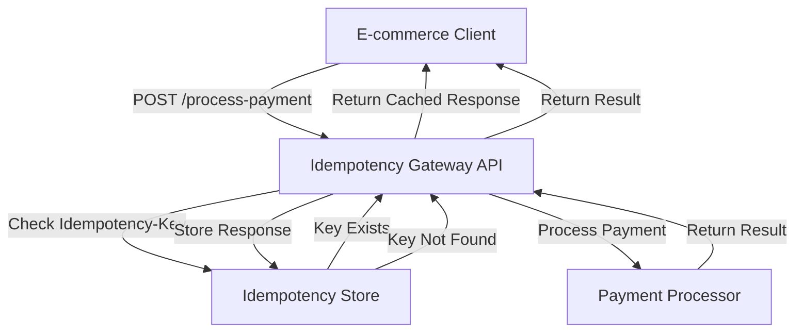
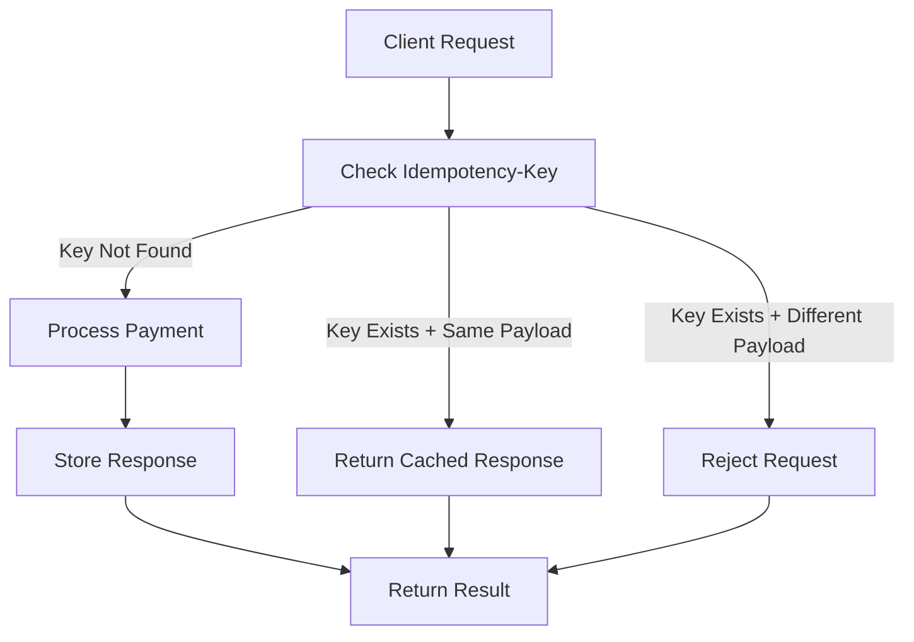
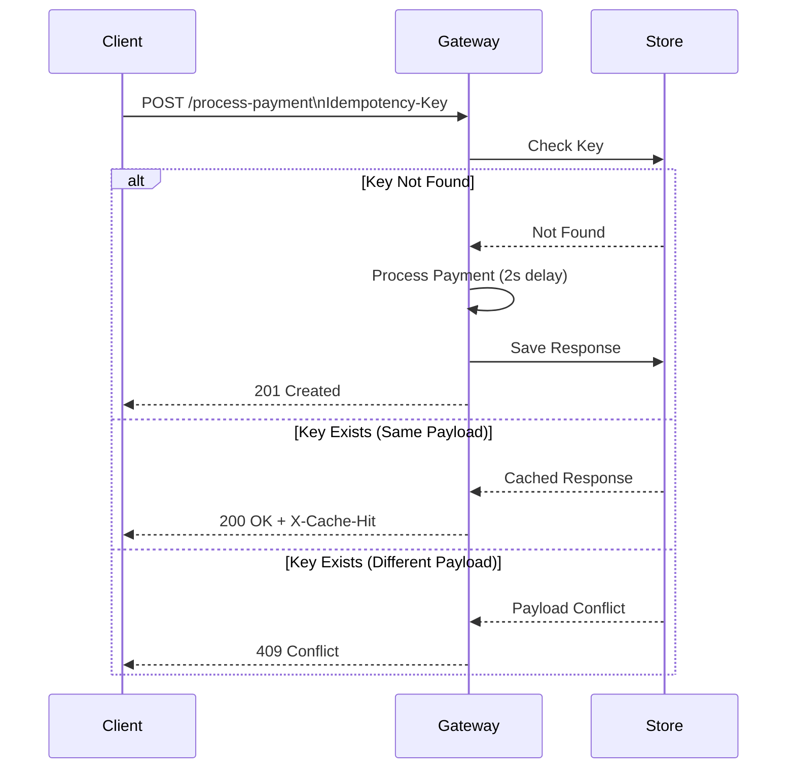
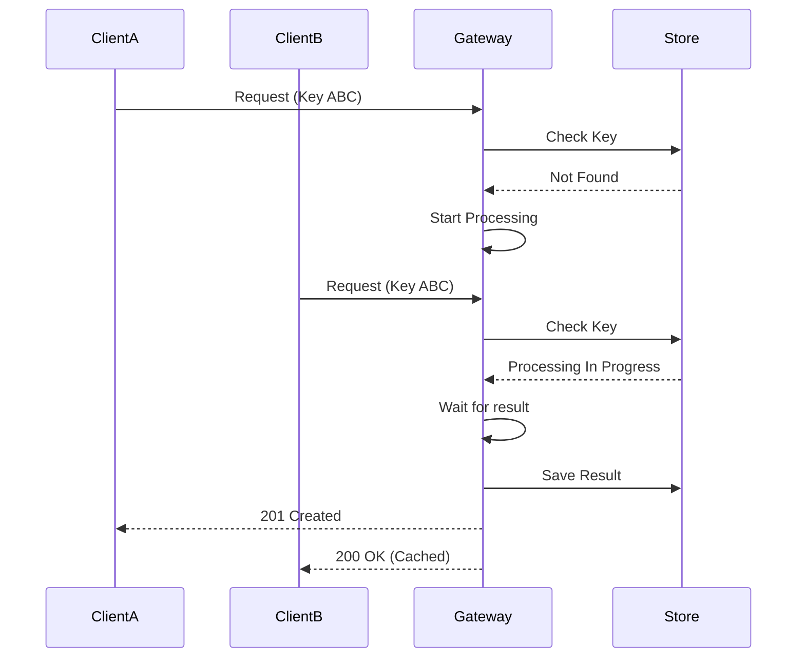

# Idempotency Gateway – Pay-Once Protocol


A **production-style Node.js/Express implementation** of an **Idempotency Gateway** that guarantees **exactly-once payment processing**.

This service prevents **duplicate financial transactions** caused by network retries, timeouts, or client failures.

When the same request is sent multiple times with the same **Idempotency-Key**, the system ensures the **payment is processed only once** and subsequent requests receive the **same cached response**.

---

# Business Context

FinSafe Transactions Ltd. processes payments for e-commerce platforms.

Network failures sometimes cause client systems to **retry payment requests**, which may lead to **duplicate charges**.

This gateway prevents double charging by implementing an **idempotency layer** that guarantees **safe retries**.

---

# System Architecture

The Idempotency Gateway sits between client applications and the payment processor.



---

# Payment Processing Flow



---

# Sequence Diagram

This diagram illustrates the **complete lifecycle of a payment request**.



---

# Handling Simultaneous Requests (Race Condition Protection)

The system safely handles **concurrent identical requests**.



This prevents **race conditions and duplicate execution**.

---

# Features

### Idempotent Payment Processing

Guarantees **exactly-once execution** for payment requests.

### Duplicate Request Detection

Repeated requests return **cached responses instantly**.

### Payload Integrity Protection

Rejects requests that reuse the same key for **different payloads**.

### In-Flight Request Handling

Simultaneous requests with the same key **wait for the first request to finish**.

### Rate Limiting (Developer’s Choice Feature)

Limits requests to **5 per minute per Idempotency-Key** to prevent abuse.

---

# Setup Instructions

Clone the repository.

```bash
git clone https://github.com/amalitechglobaltraining/Idempotency-Gateway
cd Idempotency-Gateway
```

Install dependencies.

```bash
npm install
```

Start the development server.

```bash
npm run dev
```

Or start normally.

```bash
npm start
```

Server runs at:

```
http://localhost:3000
```

---

# API Documentation

## POST /process-payment

Processes a payment request.

### Headers

```
Idempotency-Key: <unique-string>
Content-Type: application/json
```

### Request Body

```json
{
  "amount": 100,
  "currency": "GHS"
}
```

---

# Success Responses

### First Request

```
201 Created
```

```json
{
  "status": "Charged 100 GHS"
}
```

---

### Duplicate Request

```
200 OK
```

Header:

```
X-Cache-Hit: true
```

Body:

```json
{
  "status": "Charged 100 GHS"
}
```

---

# Error Responses

### Same Key With Different Payload

```
409 Conflict
```

or

```
422 Unprocessable Entity
```

```json
{
  "error": "Idempotency key already used for a different request body."
}
```

---

### Rate Limit Exceeded

```
429 Too Many Requests
```

```json
{
  "error": "Rate limit exceeded: max 5 requests per minute for this Idempotency-Key."
}
```

---

# Developer's Choice Feature – Rate Limiting

### Policy

| Limit      | Window   | Scope               |
| ---------- | -------- | ------------------- |
| 5 requests | 1 minute | per Idempotency-Key |

### Why It Matters

Prevents:

* accidental retry loops
* malicious request floods
* system overload

---

# Project Structure

```
Idempotency-Gateway
│
├── src
│   ├── controllers
│   │       paymentController.js
│   │
│   ├── middleware
│   │       idempotencyMiddleware.js
│   │       rateLimiter.js
│   │
│   ├── routes
│   │       paymentRoutes.js
│   │
│   ├── services
│   │       paymentService.js
│   │
│   └── app.js
│
├── package.json
└── README.md
```

---

# Design Decisions

### In-Memory Idempotency Store

A **JavaScript Map** stores:

* idempotency keys
* request payloads
* responses
* processing state

Advantages:

* O(1) lookup
* simple implementation
* suitable for prototype environments

---

# Scalability Considerations

For production fintech systems, the architecture can be upgraded.

---

## Redis Idempotency Store

Replace in-memory storage with Redis.

Benefits:

* shared state across servers
* high performance
* persistence
* TTL expiration

Example architecture:

```
Client
  │
  ▼
Load Balancer
  │
  ├── Gateway Instance 1
  ├── Gateway Instance 2
  ├── Gateway Instance 3
  │
  ▼
Redis Idempotency Store
```

---

## Distributed Locks

Prevent duplicate execution across servers using:

* Redis Redlock
* ZooKeeper
* Etcd

Workflow:

```
Acquire lock on Idempotency-Key
        │
        ▼
Process payment
        │
        ▼
Release lock
```

---

# Load Testing

The gateway can be stress-tested using **autocannon**.

Example:

```bash
npx autocannon -m POST http://localhost:3000/process-payment \
-H "Idempotency-Key: test123" \
-H "Content-Type: application/json" \
-b '{"amount":100,"currency":"GHS"}'
```

This verifies:

* response caching performance
* concurrency safety
* request throughput

---

# Security Considerations

A real production system should include:

* API authentication
* request signature validation
* TLS encryption
* payload hashing
* centralized logging
* monitoring and alerting

---

# Future Improvements

Potential enhancements include:

* Redis persistence with TTL
* client-level rate limiting
* metrics with Prometheus
* distributed tracing with OpenTelemetry
* integration with real payment gateways

---

# Conclusion

This project demonstrates how **backend engineering principles and distributed system design** can prevent duplicate financial transactions.

By combining:

* idempotency keys
* request caching
* concurrency control
* rate limiting

the gateway provides a **robust foundation for reliable payment processing in fintech systems**.
